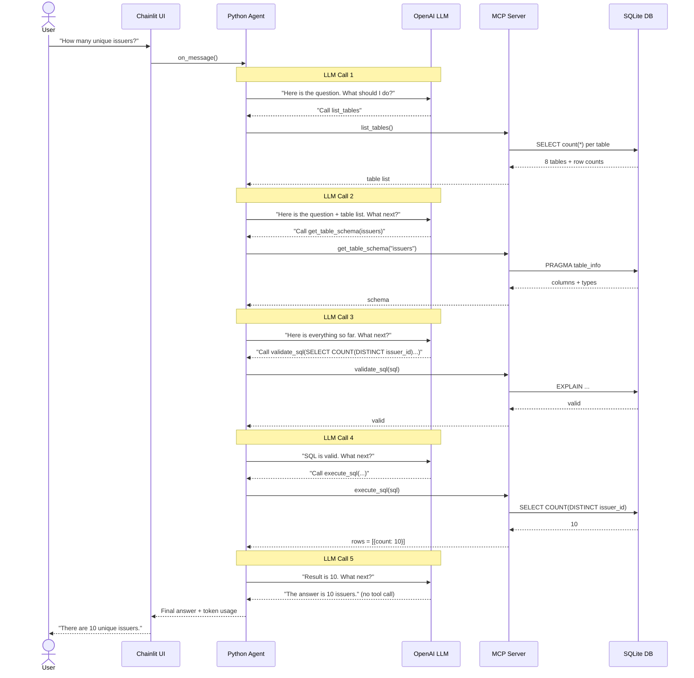

# Card Payments Text2SQL Agent — PoC

A fully agentic Text2SQL system over a synthetic Card Payments database.
Uses **OpenAI gpt-4o-mini** + **MCP (HTTP/SSE)** + **Chainlit** for a
rich chain-of-thought UI.

---

## Architecture

```
┌─────────────────────────────────────────────────────────────────┐
│                        Chainlit UI  :8000                       │
│   User query → chain-of-thought steps → tool calls → answer    │
└───────────────────────────┬─────────────────────────────────────┘
                            │  async callbacks
┌───────────────────────────▼─────────────────────────────────────┐
│                     Text2SQL Agent                              │
│   OpenAI gpt-4o-mini  ←→  function calling loop                │
│   • Reasons about tables  • Decomposes queries                  │
│   • Validates SQL          • Self-corrects on errors            │
└───────────────────────────┬─────────────────────────────────────┘
                            │  HTTP/SSE
┌───────────────────────────▼─────────────────────────────────────┐
│                 CardPayments MCP Server  :8001                  │
│  Tools:                        Resources:                       │
│  • list_tables                 • payments://glossary            │
│  • get_table_schema            • payments://business_rules      │
│  • get_table_metadata          • payments://er_diagram          │
│  • get_sample_data                                              │
│  • get_table_relationships                                      │
│  • validate_sql                                                 │
│  • execute_sql                                                  │
│  • get_column_stats                                             │
└───────────────────────────┬─────────────────────────────────────┘
                            │  sqlite3
┌───────────────────────────▼─────────────────────────────────────┐
│                   SQLite  data/payments.db                      │
│  8 tables: issuers • merchants • cards • authorizations         │
│            transactions • clearing • chargebacks • disputes     │
└─────────────────────────────────────────────────────────────────┘
```

---

## Quick Start

### 1. Prerequisites
```bash
python >= 3.11
pip
```

### 2. Clone / extract the project
```bash
cd text2sql_poc
```

### 3. Set your OpenAI API key

**Option A — .env file (recommended for Windows)**
```bash
# Copy the example file and fill in your key
cp .env.example .env
```
Then edit `.env`:
```
OPENAI_API_KEY=sk-...your-key-here...
```

**Option B — shell export**
```bash
export OPENAI_API_KEY=sk-...your-key-here...
```

### 4. Run everything
```bash
chmod +x start.sh
./start.sh
```

This will:
- Install all Python dependencies
- Generate 8 synthetic CSVs (card payments domain data)
- Load them into a local SQLite database
- Start the MCP server on **http://localhost:8001**
- Start the Chainlit UI on **http://localhost:8000**

Open **http://localhost:8000** in your browser.

---

## Project Structure

```
text2sql_poc/
├── app.py                   # Chainlit UI entrypoint
├── start.sh                 # One-command launcher
├── requirements.txt
├── .env.example             # API key template — copy to .env
├── .chainlit/
│   └── config.toml
├── agent/
│   └── agent.py             # Agentic loop (OpenAI + MCP tools)
├── mcp_server/
│   └── server.py            # FastMCP HTTP/SSE server (tools + resources)
├── scripts/
│   ├── generate_data.py     # Synthetic data generator
│   └── load_db.py           # CSV → SQLite loader
└── data/
    ├── csv/                 # 8 generated CSV files
    └── payments.db          # SQLite database (auto-created)
```

---

## Database Schema

| Table | Rows | Description |
|-------|------|-------------|
| `issuers` | 10 | Card-issuing banks |
| `merchants` | 20 | Merchants accepting payments |
| `cards` | 200 | Payment cards issued to customers |
| `authorizations` | 500 | Real-time auth requests |
| `transactions` | 400 | Completed settled transactions |
| `clearing` | 350 | Clearing & reconciliation records |
| `chargebacks` | 100 | Disputed transactions |
| `dispute_cases` | 80 | Customer service dispute cases |

---

## MCP Server — Exploring the API

The MCP server runs on port **8001** and exposes its full catalogue via Swagger and ReDoc.
Once the server is running, open any of these URLs:

| URL | Description |
|-----|-------------|
| `http://localhost:8001/docs` | **Swagger UI** — interactive docs, browse all tools and resources |
| `http://localhost:8001/redoc` | **ReDoc** — clean read-only reference documentation |
| `http://localhost:8001/openapi.json` | **OpenAPI 3.1 schema** — raw JSON spec |
| `http://localhost:8001/sse` | MCP SSE endpoint (used by the agent) |

### Swagger UI
The Swagger UI (`/docs`) is the easiest way to explore what the MCP server offers.
It organises everything into three tagged sections:

**MCP Tools** — tools the agent calls to explore schema and run SQL:

| Tool | What it does |
|------|-------------|
| `list_tables` | See all 8 tables with row counts and domain |
| `get_table_schema` | Column names, types and business descriptions for any table |
| `get_table_metadata` | Rich domain context and FK relationship hints |
| `get_sample_data` | Sample rows to understand actual data formats |
| `get_table_relationships` | Full ERD showing all join keys between tables |
| `validate_sql` | Safe syntax check via SQLite EXPLAIN — no data touched |
| `execute_sql` | Run a SELECT query and get results back as JSON |
| `get_column_stats` | Min/max/avg for numeric columns; top values for text columns |

**MCP Resources** — static reference content the agent can read:

| Resource URI | Content |
|-------------|---------|
| `payments://glossary` | Definitions of card payments terms (authorization, chargeback, interchange, etc.) |
| `payments://business_rules` | Thresholds and SLAs (chargeback rate limits, risk score cutoffs, dispute SLAs) |
| `payments://er_diagram` | Full entity relationship diagram with all FK relationships |

**MCP Protocol** — the raw SSE transport endpoints used by the agent.

---

## Example Questions to Ask

**Basic:**
- What is the total count of unique issuers?
- How many authorizations were declined and what were the reasons?
- List all active corporate cards

**Intermediate:**
- Which issuers have the most chargebacks filed against them?
- Show me transactions that went cross-border at high-risk merchants
- What percentage of disputes have breached SLA?

**Advanced:**
- For each merchant, show total auth amount vs total cleared amount and the difference
- Find cards where the last 3 transactions were all declined
- Which chargeback reason codes have the highest merchant win rate?

---

## Configuration

| Env Variable | Default | Purpose |
|-------------|---------|---------|
| `OPENAI_API_KEY` | _(required)_ | Your OpenAI key |
| `MCP_SERVER_URL` | `http://localhost:8001/sse` | MCP server SSE endpoint |

---

## How the Agent Works

1. **Receives** the user's natural language question
2. **Scope guard** rejects off-topic questions immediately before any LLM call
3. **Calls `list_tables`** to orient itself (or goes direct if context is clear)
4. **Calls `get_table_schema`** / `get_table_metadata` for relevant tables
5. **Checks `get_table_relationships`** to plan JOINs
6. **Optionally calls `get_sample_data`** or `get_column_stats` to understand values
7. **Generates SQL** based on gathered context
8. **Calls `validate_sql`** — if invalid, fixes and retries automatically
9. **Calls `execute_sql`** to run the query
10. **Returns results** with a business-friendly explanation

All steps stream live in the Chainlit UI as expandable steps showing the tool input, generated SQL and results.

---

## Understanding the Agentic Loop

A common question is: *"why are there 5 LLM calls just to answer one question?"*

The LLM does not call the MCP tools directly. Instead:
- The **LLM** is the brain — it reads the conversation and decides what tool to call next
- The **Python agent** is the glue — it receives that decision, calls the MCP tool, and sends the result back
- The **MCP server** is the executor — it actually queries the database

Every round trip back to the LLM (*"here's the tool result, what should I do now?"*) counts as one LLM call. The LLM has no memory between calls, so the full conversation history must be sent each time.



Each numbered LLM call costs tokens — and because the full conversation history is
resent every time, earlier messages are paid for repeatedly. This is why complex
questions with many tool calls are more expensive than simple ones.